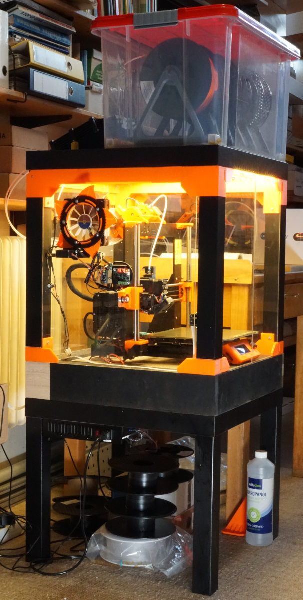
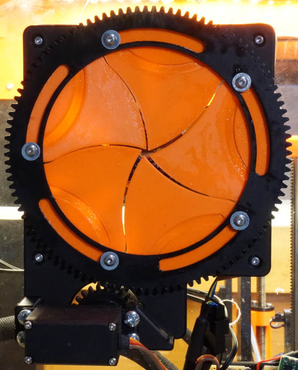
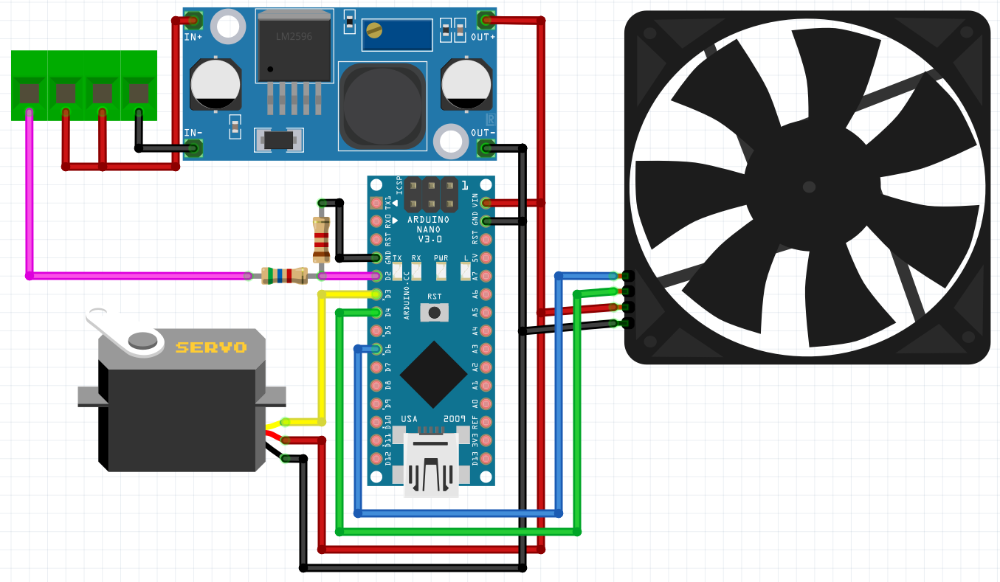

# PrinterCaseServo

This repository contains [3D files (STLs)](STLs/) for the parts for building your own air regulator with iris shaped door for a Lack table printer encosure. In the folder [schematic/](schematic/) you find information on the wiring. The sourcecode for the Arduino Nano lives in [src/](src/main.cpp), the configuration for PlatformIO is in [platformio.ini](platformio.ini).

